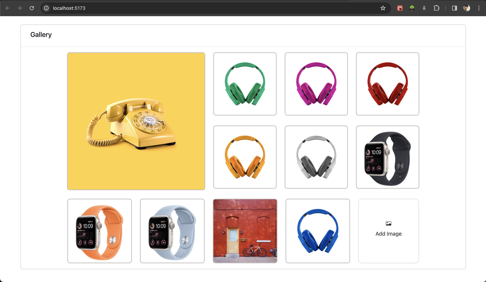
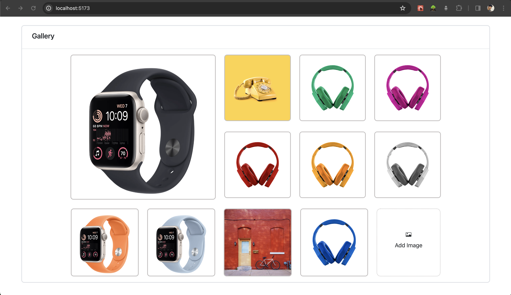

# Drag and Drop App

This is a responsive Drag and Drop gallery web app.

This web app using dependencies are:
```bash
"@dnd-kit/core": "^6.0.8",
"@dnd-kit/sortable": "^7.0.2",
"@dnd-kit/utilities": "^3.2.1",
"bootstrap": "^5.3.2",
```

1. First download the code and run:
```bash
npm install
```

2. Run the development server:
```bash
npm run dev
```

Open [http://localhost:5173](http://localhost:5173) with your browser to see the result.

## Drag and Drop app view

